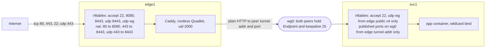
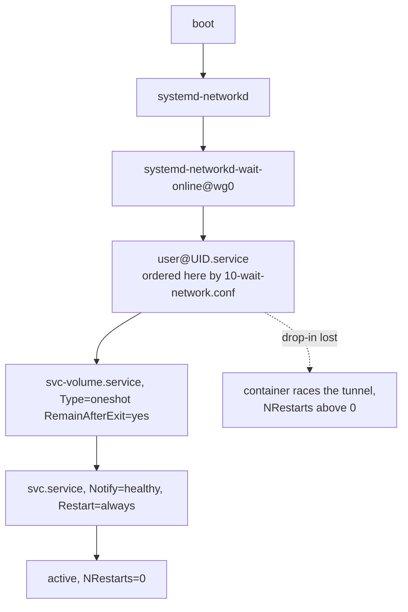
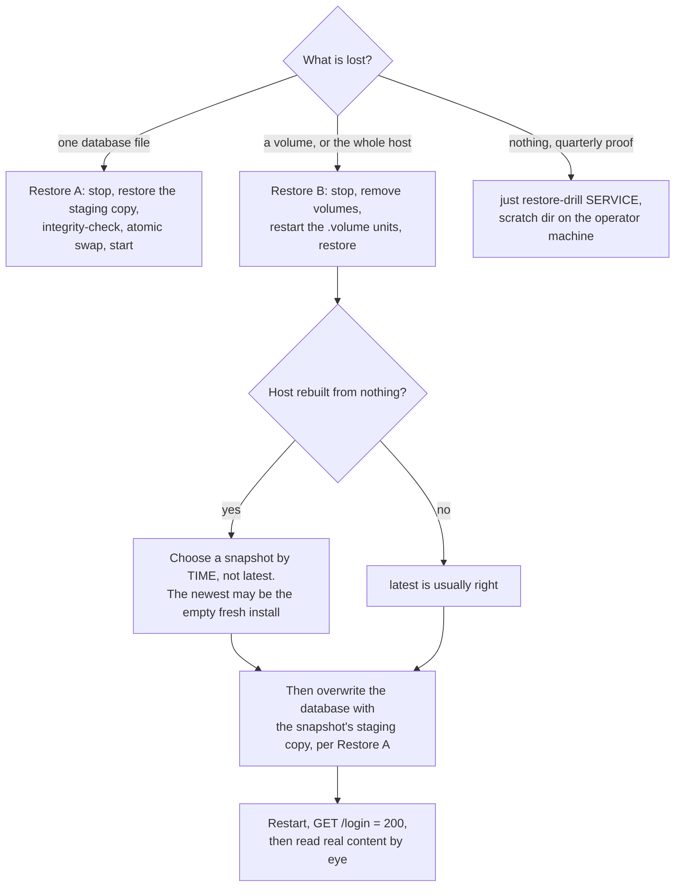

<!-- SPDX-License-Identifier: CC-BY-4.0 -->
<!-- SPDX-FileCopyrightText: 2026 Aryan Ameri <info@ameri.me> -->

# deerlab runbook

- Two Debian 13 VPSs, Ansible only. `edge1` runs Caddy; `svc1` runs each application as a rootless Podman Quadlet under its own system user; kernel WireGuard between them; delivery by `ansible-pull` from a signed `release` branch
- Written for someone holding only this repository, under time pressure, with nobody to ask: it records what is silent when it goes wrong
- Read [What is not proven](#what-is-not-proven) before trusting any procedure here in a real disaster
- `<svc>` is a service name, which is also its username; `<uid>` is its uid. Substitute `<placeholders>` and `{{ inventory_variable }}` from the decrypted inventory, and never paste a real value back into this file
- Addresses, ports, accounts, buckets, endpoints and credentials are encrypted in the inventory. The domain and its hostnames are encrypted too, but a public CA publishes every issued hostname to Certificate Transparency: indirection, not secrecy. Never build a control on them being hidden

## Contents

[Before you can do anything](#before-you-can-do-anything) ·
[The shape of the estate](#the-shape-of-the-estate) ·
[Where everything lives on a host](#where-everything-lives-on-a-host) ·
[Delivery](#delivery) · [Reading state on a host](#reading-state-on-a-host) ·
[Reboots and planned maintenance](#reboots-and-planned-maintenance) ·
[Alerts, and what only looks like a fault](#alerts-and-what-only-looks-like-a-fault) ·
[Backups](#backups) · [Restore](#restore) ·
[Rebuilding a host from nothing](#rebuilding-a-host-from-nothing) ·
[Bootstrapping a host](#bootstrapping-a-host) · [Adding a service](#adding-a-service) ·
[Rotating a secret](#rotating-a-secret) ·
[SSH from a machine with several keys](#ssh-from-a-machine-with-several-keys) ·
[Break-glass](#break-glass) · [What is not proven](#what-is-not-proven)

## Before you can do anything

- Neither of the two below is **in this repository or recoverable from it**. A rebuild is impossible without the first and unsafe without the second

### The SOPS age identity

- Recipients in `.sops.yaml`: the operator key, plus one per host that `base_pull` generates on the host itself
- The operator identity is never on disk: the login shell exports `SOPS_AGE_KEY_CMD` and `sops` runs it on every decryption. A process that does not inherit it cannot decrypt — export it inline in front of the command, never write a key file
- **Operator machine:** never set `SOPS_AGE_KEY_FILE`, never create `~/.config/sops/age/keys.txt`. `sops` checks the file variable *before* the command variable, so a stray key file silently retires the vault route and puts the identity back on disk
- **Hosts: the opposite, by design.** No vault and no interactive shell there, so `deerlab-pull.service` sets `Environment=SOPS_AGE_KEY_FILE=/etc/deerlab/age.key` — 0400, generated on the host at bootstrap. Every host must be a `.sops.yaml` recipient before its first unattended pull can decrypt
- `sops`, `ansible` or `just` **hanging** rather than failing means the vault is locked. A hang is not a decryption error
- Losing the identity loses the configuration secrets permanently: the host keys decrypt `inventory/` but live on the hosts being rebuilt, and `secrets/` is encrypted to the operator key alone

### The object store's version-retention window

- Every `*.sops.yaml` under `inventory/` is encrypted to **both** host keys. `base_wireguard` and `base_firewall` read `hostvars[<peer>]`, forcing each host to compute the peer's whole variable set, so a host that cannot decrypt the other's vars cannot parse the inventory at all
- Both hosts therefore hold every service's restic password and object-store keys, and the ciphertext is in a public repository besides. **Assume a compromise of either host reaches every service's repository**
- Prefix scoping is real — one service's key is refused at the `Stat` of another's repository config object — but it buys no per-host blast radius
- Those credentials can delete, and must: `restic backup` takes and releases a lock under `locks/` on every run
- The only thing between a compromised host and erased history is that **the object store retains prior versions of deleted objects for a fixed window**. Set at the provider, recorded nowhere here, verified by nothing in the estate
- It is a *detection deadline*, not immutability: it buys time for the dead-man checks to notice. **Backup alerts silent for longer than that window mean the history may already be gone.** Look the window up before you need it
- `secrets/backup-admin.sops.yaml` holds the operator's full-access object-store credential, encrypted to the operator key alone, never given to a host — so a host compromise cannot reach the credential that erases everything

## The shape of the estate



| | edge host `edge1` | services host `svc1` |
| --- | --- | --- |
| Groups | `edge`, `podman_hosts` | `services`, `podman_hosts` |
| Public inbound | tcp 22, 80, 443, **8080, 8443**; udp 443, **8443**; udp WireGuard port | tcp 22; udp WireGuard port, **from the edge's public v4 only** |
| Tunnel inbound | — | each published backend port on `wg0`, from the edge's tunnel v4/v6 only |
| Runs | sshd, Caddy | sshd, application services |
| Service users | one, uid 2000 | one per application, uid from 2001 |

- Stock Debian 13, dual-stack on the public side, `base_*` roles only; nothing installed by hand. **Ansible is the only executor** — no hypervisor, no OpenTofu, no orchestrator, no control plane for the tunnel
- Host ports 80/443 reach Caddy through an nftables redirect to 8080/8443. Caddy still listens on 80 and 443 inside its namespace, so its own redirects and ACME challenges work unchanged
- Tunnel: kernel WireGuard via `systemd-networkd`, one `.netdev` and one `.network` per host. **Both peers carry `Endpoint=`**, an explicit `ListenPort` and `PersistentKeepalive=25`, so either can initiate and neither depends on the other being up first
- Caddy proxies plain HTTP over it: WireGuard already supplies confidentiality, integrity and peer authentication
- Backends publish on the wildcard address, never the tunnel address — a unit binding the tunnel address races the interface at boot and fails hard on Podman 5.4.2. **The firewall, not the bind address, scopes a backend to the tunnel**
- One `podman_services` entry derives the service user, its 65536-wide subordinate ID range, its firewall egress chain, its slice limits, its Quadlet units, its Podman secrets, and its backup unit and timer
- **Subordinate ID ranges are arithmetic, not allocated:** `podman_user_subid_base + (uid - podman_user_uid_base) * podman_user_subid_count`, from `roles/podman_user/templates/subid.j2`. A rebuilt host derives the same mapping from the same inventory, which is what makes a restore portable
- Corollary, and a live hazard: **changing a service's `uid`, or `podman_user_uid_base` / `podman_user_subid_base` / `podman_user_subid_count`, silently invalidates the file ownership recorded in every existing snapshot for that service**

## Where everything lives on a host

| Thing | Path |
| --- | --- |
| Pull unit and timer | `/etc/systemd/system/deerlab-pull.{service,timer}` |
| Pull checkout | `/var/lib/deerlab/checkout` |
| Pull's Ansible virtualenv | `/opt/deerlab/venv` |
| Host's age identity | `/etc/deerlab/age.key` (0400 root) |
| Allowed signers for `--verify-commit` | `/etc/deerlab/allowed_signers` |
| Pushover credential, system scope | `/etc/deerlab/pushover.conf` |
| Pushover credential, per service user | `/etc/deerlab/pushover/<svc>.conf` |
| Quadlet units | `/etc/containers/systemd/users/<uid>/` |
| Service home | `/var/lib/<svc>` (0700) |
| Service config files | `/var/lib/<svc>/config/` |
| Podman volumes | `/var/lib/<svc>/.local/share/containers/storage/volumes/<svc>-<volume>/_data` |
| Backup env, password, dead-man conf | `/etc/deerlab/backup/<svc>.env`, `.password`, `-deadman.conf` |
| Backup bootstrap marker | `/etc/deerlab/backup/<svc>.initialised` |
| Backup unit and timer | `/etc/systemd/user/deerlab-backup-<svc>.{service,timer}` |
| SQLite staging copy | `/var/lib/<svc>/backup/staging/` |
| User-manager ordering drop-in | `/etc/systemd/system/user@<uid>.service.d/10-wait-network.conf` |
| Per-service slice limits | `/etc/systemd/system/user-<uid>.slice.d/50-deerlab.conf` |
| Firewall ruleset | `/etc/nftables.conf` |
| WireGuard | `/etc/systemd/network/50-wg0.{netdev,network}`, `wg0.key`, `wg0.psk` |

- Quadlet units are `root:root` 0644: the service user reads its unit, never rewrites it
- The bare `/etc/containers/systemd/users/` directory is never used; a unit placed there runs under *every* lingering user

## Delivery

```mermaid
flowchart LR
  b["branch, change, just ci"] --> pr["pull request, CI workflow"]
  pr --> m["just merge BRANCH: waits for required checks,<br/>ff main locally, git verify-commit HEAD, pushes"]
  m --> ci["CI on the push to main"]
  ci -->|"success"| pm["Promote workflow:<br/>ff release to the exact sha CI passed on"]
  pm --> rel["release branch"]
  rel --> t["deerlab-pull.timer, every host"]
  t --> ap["ansible-pull --verify-commit<br/>against /etc/deerlab/allowed_signers"]
  ap --> site["site.yml --limit self"]
  site --> dm["dead-man ping on success"]
```



| Recipe | Effect |
| --- | --- |
| `just ci` | the whole pipeline locally; the only gate |
| `just plan HOST` | check-and-diff `site.yml` against a real host |
| `just apply HOST` | push directly; bootstrap and break-glass only |
| `just bootstrap HOST` | first run on a fresh image, as root, pull timer held off |
| `just idempotency HOST` | apply twice, fail if the second run changed anything |
| `just merge BRANCH` | fast-forward `main` from your machine, then verify the head |
| `just secrets-edit FILE`, `just secrets-rekey` | edit, or re-encrypt for the current recipients |
| `just backup-prune SVC`, `just restore-drill SVC` | one argument, the service name |

- Timer: `OnCalendar=*:0/30`, `RandomizedDelaySec=300`, `Persistent=true`. It checks out `release`, verifies the head commit's SSH signature against `/etc/deerlab/allowed_signers`, and applies `site.yml --limit <itself>`
- Pull sooner with `mise x -- ansible <host> -b -m ansible.builtin.shell -a 'systemctl start deerlab-pull.service'`
- `Promote` fast-forwards `release` to the commit CI passed on, not to whatever `main` points at when it runs, and only for a **push** to `main`. It is the only thing that pushes `release`
- GitHub's own merge buttons rewrite or re-sign commits and the hosts would reject the result. Hence `just merge`, which fast-forwards from your machine so your signature stays on the head
- Commits created through the GitHub API — **every** Renovate commit — carry GitHub's web-flow GPG signature rather than a key in `deerlab_allowed_signers`, and the hosts refuse them. Rebase a bot branch under your own key first: `git rebase --force-rebase -S main`
- The gate that matters is on the host, not on GitHub. There are no server-side branch rules: GitHub calls a commit verified if *any* registered key signed it, while `ansible-pull --verify-commit` demands a key from the allowed-signers file. An unverifiable commit halts delivery and pages, whatever GitHub accepted
- **`just plan` reports exactly one change on a converged host**: `base_pull : Install Ansible into its virtual environment`, because `ansible.builtin.pip` cannot tell whether requirements are satisfied without invoking pip, which check mode forbids. **Anything beyond that one change is real drift**
- **`just plan` requires an already-bootstrapped host.** `podman_service` runs `podman info` as each service user, and that user does not exist until a real run has created it. Check mode against a fresh image fails; use `just bootstrap`

## Reading state on a host

- No root SSH on either host: connect as `{{ deerlab_admin_user }}` (encrypted in `inventory/group_vars/all/`) and `sudo -i`. `ansible.cfg` sets `become = true` globally, so ad-hoc Ansible escalates without `-b`; the examples pass it anyway so they read correctly out of context

```sh
# Is a pull running? `systemctl is-active --quiet` LIES here - see below.
systemctl show deerlab-pull.service -p ActiveState --value
systemctl list-timers deerlab-pull.timer --no-pager

# Service state, from the system side
systemctl --user --machine=<svc>@ show <svc>.service \
  -p ActiveState -p SubState -p Result -p NRestarts

# Logs. `journalctl --machine=<svc>@` does NOT work: it attempts namespace
# entry. Match on the unit and uid instead.
journalctl _SYSTEMD_USER_UNIT=<svc>.service _UID=<uid> --since "-10 min" -o cat

# Anything run directly as the service user needs a working directory that user
# can reach. Run it from /, or runuser dies on `cannot chdir`.
cd / && runuser -u <svc> -- podman volume ls
```

- **`systemctl is-active --quiet deerlab-pull.service` is wrong and will mislead you.** A `Type=oneshot` unit that is *running* is `activating`, not `active`, so `is-active` exits non-zero and you conclude nothing is running while a pull is in flight. This exact mistake caused a service to be restarted underneath an operator mid-drill. Always `systemctl show deerlab-pull.service -p ActiveState --value`; `inactive` or `failed` means done
- A healthy pull takes roughly 90 seconds, bounded by `TimeoutStartSec=20m`. The 0–300s randomised delay means two consecutive firings can land 25 minutes apart, not a clean 30
- **The pull is a live hazard during any manual intervention**, and there is no safe way to suppress it: stopping the timer is self-trapping, because only a pull re-enables it. Mitigate procedurally — check `ActiveState`, confirm the timer has headroom, work in the window straight after a pull completes

## Reboots and planned maintenance

- Automatic reboots are off; a daily timer posts `Reboot required on <host>` to Pushover for as long as `/run/reboot-required` exists



- Order: **services host first, then the edge**

```sh
mise x -- ansible svc1 -b -m ansible.builtin.reboot
mise x -- ansible svc1 -b -m ansible.builtin.shell \
  -a 'systemctl --user --machine=<svc>@ is-active <svc>.service'
mise x -- ansible edge1 -b -m ansible.builtin.reboot
```

- **Services host:** back in about a minute. The unit is `activating` immediately and reaches `active` 30–60s later; `NRestarts` stays `0`. Non-zero `NRestarts` means the wait-network drop-in has been lost and the unit is racing the tunnel at boot
- **Edge host:** down roughly 15 seconds; the tunnel re-establishes within about a second of the interface coming up, because both peers hold an `Endpoint=`
- An earlier design gave the edge no `Endpoint=`: it learned the peer's address at runtime, lost it on every reboot, could not initiate, and recovery waited out WireGuard's `REJECT_AFTER_TIME`. Measured across two reboots the backend was unreachable for 30s and for 183s — a 0–180s window in which Caddy was fully up and every real request got `503 no upstreams available`
- **Minutes of `503 no upstreams available` after an edge reboot mean the peer `Endpoint=` or the source-scoped inbound WireGuard rule on the services host has been lost.** Not a transient. Check `base_wireguard_public_endpoint` on both hosts and the services host's inbound rule before looking anywhere else

## Alerts, and what only looks like a fault

- Two channels, sharing no failure domain
- **Nothing watches the external monitor itself**

| Channel | Reports | Wired by |
| --- | --- | --- |
| Pushover, direct from each host | a unit that **failed** | `OnFailure=` on every Quadlet, every backup unit, the pull unit, and `base_notify_onfailure_units` (`nftables.service`, `systemd-networkd.service`); the reboot-required timer posts the same way |
| Dead-man push monitors, on an external uptime monitor | a host that **stopped running anything** | `ExecStartPost` curl on each successful pull and each successful backup |

- Notifications leave the host directly and depend on neither the edge nor the external monitor: an outage of the thing that watches must not silence the thing that reports
- Push URLs are bearer secrets, in SOPS as `deerlab_deadman_urls`. Anyone holding one can mark a check healthy and mask a real outage

### Expected, not incidents

| Symptom | Why |
| --- | --- |
| Stopping any service leaves it `failed` and pages you | Quadlets carry `Restart=always` and `Notify=healthy`, and Podman exits non-zero on `SIGTERM`, so an explicit `systemctl --user stop` ends `ActiveState=failed` and trips `OnFailure=`. Exactly one alert per stop; do not chase it. `Restart=always` does not resurrect after an explicit stop, so the stop holds |
| Red backup dead-man **and** a Pushover alert | May mean "snapshot fine, repository unverifiable": `restic check` runs *after* the snapshot is committed and a check failure fails the unit, so `ExecStartPost` — the dead-man ping — is skipped. Read the journal before concluding the snapshot did not happen |
| `just plan` reports one change on a converged host | The pip task, not drift. See [Delivery](#delivery) |
| A host briefly ahead of `release` after `just apply` | Reverted by the next pull, restarting the affected unit once. Resolves when the commit is promoted |

### The health check does not prove the data is good

| Measured state | `ActiveState` | health check | `GET /login` |
| --- | --- | --- | --- |
| database overwritten with random bytes, service left **running** | `active` | 200 | 200 |
| database overwritten with random bytes, service **restarted** onto it | `active` | 200 | 500 |
| restored | `active` | 200 | 200 |

- A running instance keeps serving 200 over a destroyed file: SQLite has the pages cached and the inode never changed. **Corruption can sit invisible until the next restart**, which with `Restart=always` may be days later and unattended
- The acceptance test after any restore is **`GET /login` returning 200 after a restart**, and nothing weaker
- Even that proves only that the database is *readable*, never that it is **yours** — see [Rebuilding a host from nothing](#rebuilding-a-host-from-nothing). Only a human looking at content can

## Backups

- One `backup` role, driven by the same `podman_services` record as everything else: per service, a user-scope oneshot unit and timer in that service's own systemd manager
- Schedule `OnCalendar=*-*-* 03:00:00` + `RandomizedDelaySec=1800` = 03:00–03:30, hosts run `Etc/UTC`, bounded by `TimeoutStartSec=1h`
- The unit's steps, in order:

1. `ExecStartPre`: `podman unshare test -s <live database>`. `sqlite3` opens its source with `OPEN_CREATE`, so a merely *wrong* path does not fail — it creates an empty 4096-byte database, copies that over the last good staging copy, passes the integrity check, uploads it and pings the dead-man, and nothing downstream can tell that from a healthy backup. `-s`, not `-f`, because a zero-length file is exactly the case to refuse
2. Online SQLite `.backup` into `/var/lib/<svc>/backup/staging/`, inside `podman unshare` so subordinate-owned files are readable
3. `PRAGMA integrity_check` on that copy, **tested** rather than merely run: `sqlite3` exits 0 on a corrupt database
4. `podman unshare restic backup` of the staging directory plus each named volume's `_data`
5. `restic check` — structural, no `--read-data`
6. `ExecStartPost`: the dead-man ping

- A service with no database skips steps 1–3
- The edge's Caddy data volume is backed up the same way, so a rebuild does not burn ACME rate limits reissuing certificates

| Hazard | Consequence |
| --- | --- |
| **`restic check` takes an exclusive repository lock**, after every snapshot | A manual `just backup-prune` fired inside the backup window contends with it. Run retention outside 03:00–03:30 UTC |
| **restic invoked by the role runs under the service user's systemd manager, not your SSH session** | It **outlives an interrupted command**: `Ctrl-C` does not stop it and it may still hold a repository lock after your terminal returns. Check `restic list locks` before calling a lock stale |
| A repository lock | **Cleared with `restic unlock`. Never by deleting objects from the repository** |
| Renaming a database path in inventory | The old file stays in staging, is never cleaned up, and keeps being archived beside the new one where a careless restore could pick it. Delete it from `/var/lib/<svc>/backup/staging/` by hand |
| Removing a volume | Check nothing else references it first — another service definition, another mount, another backup path |
| `restic` on the hosts is Debian's, not the version pinned in `mise.toml` | That pin is the operator machine's. Do not assume flag parity |

- **`/etc/deerlab/backup/<svc>.initialised` is a safety marker, not clutter.** It records that the repository is bootstrapped, so unattended pulls stop probing the object store forever
- It also stops a repository *deleted at the provider* from being silently recreated: without it the next pull would `restic init` a fresh empty one, the backup would succeed against it, and the dead-man would go green over no history at all. With it `restic backup` fails loudly — the alarm you want
- **Deleting that file is not a troubleshooting step.** Delete it only to deliberately re-bootstrap a repository you have decided is genuinely gone, knowing history restarts at zero

### Retention

- Runs **from the operator's machine only**, on the full-access credential in `secrets/backup-admin.sops.yaml`: `just backup-prune <service>`
- Policy: `forget --keep-within 30d --keep-within-weekly 3m --keep-within-monthly 1y --prune`, as restic recommends for append-only repositories
- `just backup-prune` and `just restore-drill` take **one** argument, the service name. The inventory file holding that service's restic password is located by the key name it contains, and the recipe fails loudly on zero or more than one match — guessing the group is how a restore drill ends up pointed at an empty repository and passes without restoring anything

## Restore



- **Restoring onto a host just rebuilt?** Read [Rebuilding a host from nothing](#rebuilding-a-host-from-nothing) first: `latest` is probably the wrong snapshot
- Every restic call below goes through one form, defined once per root shell — substitute `<svc>` here and nowhere else:

```sh
# Credentials reach restic through the same EnvironmentFile systemd already
# parses, never as a KEY=value prefix on a command line: /proc/<pid>/cmdline is
# 0444 and readable by any local account, including one service user reading
# another's; only /proc/<pid>/environ is protected, at 0400. Do NOT "simplify"
# this by exporting credentials in your shell. --pipe --wait --collect
# propagates exit status faithfully - verified.
R() { systemd-run --machine=<svc>@ --user --quiet --pipe --wait --collect \
  --property=EnvironmentFile=/etc/deerlab/backup/<svc>.env \
  --setenv=RESTIC_PASSWORD_FILE=/etc/deerlab/backup/<svc>.password "$@"; }
```

### Pre-flight, every time

- Check (a) every time: it bit during the drill that produced this procedure, when a pull started the service back up underneath the operator mid-restore
- Checks (b) and (c) have never caught anything — no repository lock has ever been encountered — but they cost seconds and guard failures this design predicts

```sh
# (a) No pull mid-flight, and enough headroom before the next one.
systemctl show deerlab-pull.service -p ActiveState --value   # need inactive|failed
systemctl list-timers deerlab-pull.timer --no-pager          # need >5 min

# (b) No backup running, and no repository lock. Empty output means no lock;
#     clear a stale one with `restic unlock`, NEVER by deleting objects.
systemctl --user --machine=<svc>@ show deerlab-backup-<svc>.service -p ActiveState --value
R /usr/bin/restic list locks

# (c) Choose the snapshot. `latest` is right for "undo the last hour" and wrong
#     for almost everything else - see the ordering requirement below.
R /usr/bin/restic snapshots --compact
```

### Drill: restore to a scratch directory

- Quarterly, from the operator's machine, on the operator credential: `just restore-drill <service>`
- Restores the latest snapshot to `/tmp/deerlab-restore-<service>` and runs `PRAGMA integrity_check` on every `*.sqlite` it finds. Touches nothing on the hosts
- Fails if the restore produced no files, produced no database, or any database answers anything but `ok` — the answer is tested, not the exit status, because `sqlite3` exits 0 on a corrupt database
- **A service that keeps no database fails this drill by design.** There is nothing here for it to check and a green tick would claim otherwise. Restore it and read the tree by hand

### A. Restore a database into a live service

- The proved sequence. Run **as root on the services host**
- **Paste it into a root shell rather than pushing it through Ansible.** Pushed, it passes through three shells (yours, Ansible's `/bin/sh -c`, and the inner `sh -c`), and `$d` eaten by the outer shell makes the copy target `/<db file>` at the filesystem root, where it silently succeeds. If you must push it, keep the script in a file and use `-a "$(cat step.sh)"`

```sh
# 1. Stop the service. It will end `failed` and page you. Expected.
systemctl --user --machine=<svc>@ stop <svc>.service
systemctl --user --machine=<svc>@ show <svc>.service -p ActiveState --value

# 2. Restore, verify, then swap atomically.
R /usr/bin/podman unshare /bin/sh -c '
set -e
d=/var/lib/<svc>/.local/share/containers/storage/volumes/<svc>-<volume>/_data/<db dir>
s=/var/lib/<svc>/backup/restore
r=$s/var/lib/<svc>/backup/staging/<db file>
rm -rf "$s"
/usr/bin/restic restore latest --target "$s" --include /var/lib/<svc>/backup/staging/<db file>
test -s "$r"
test "$(/usr/bin/sqlite3 "$r" "PRAGMA integrity_check")" = ok
own=$(stat -c '%u:%g' "$d/<db file>" 2>/dev/null || echo 65534:65534)
mode=$(stat -c '%a' "$d/<db file>" 2>/dev/null || echo 644)
cp "$r" "$d/<db file>.restored"
chown "$own" "$d/<db file>.restored"
chmod "$mode" "$d/<db file>.restored"
rm -f "$d/<db file>-wal" "$d/<db file>-shm" "$d/<db file>-journal"
mv -f "$d/<db file>.restored" "$d/<db file>"
rm -rf "$s"
'
echo "restore rc=$?"   # must be 0

# 3. Start, then verify with a real request. is-active and the health check both
#    return green over a destroyed database - see above.
systemctl --user --machine=<svc>@ start <svc>.service
curl -s -o /dev/null -w "login=%{http_code}\n" http://127.0.0.1:<port>/login
```

| Line | Why it is that way |
| --- | --- |
| `test -s` and `integrity_check` **before** the copy | Copy first and find out afterwards, and a bad restore has already landed |
| `cp` to `.restored`, then `mv -f` within the same directory | `cp` onto the live path truncates and rewrites the live inode, and anything reading it mid-copy — an `ansible-pull`-triggered start, for instance — sees a torn file. A rename within one filesystem is atomic |
| `stat` the live file for owner and mode | `cp` onto an *existing* file keeps that file's mode, but in the disaster this is for the file may be gone, and owner and mode would then come from the transient unit's umask. Reading them first keeps the procedure free of service-specific constants |
| `rm -f` the `-journal` as well as `-wal`/`-shm` | This database is not in WAL mode, so no `-wal`/`-shm` exist at all; `-journal`, the rollback journal, is what can re-corrupt a freshly restored database. Removing all three costs nothing |
| the `65534:65534 644` fallback | **Only a fallback, and not universal.** Inside `podman unshare` the service user is uid 0 and *this* image's web-server user maps to namespace uid 65534. `ls` renders it `nobody nogroup` from the host's `/etc/passwd`; it is a real mapped id, not an unmapped one. **Another image maps a different uid** — `stat` the live tree first, and never copy this number into another service's procedure |
| a summary reading `Restored 6 / 1 files/dirs` | Normal. `restic restore --include` still creates the whole parent directory chain, so the file lands at a nested absolute path under `--target` |

### B. Rebuild a service's volumes from a snapshot

- **Use when:** the volumes themselves are gone, not just a file inside one
- Proved end to end: both volumes removed outright, recreated empty by their Quadlet units, restored, service `active`/`healthy` 37 seconds after start, database byte-identical to the pre-drill file
- Run as root on the services host, from `/`

```sh
V=/var/lib/<svc>/.local/share/containers/storage/volumes
export XDG_RUNTIME_DIR=/run/user/<uid>
export DBUS_SESSION_BUS_ADDRESS=unix:path=/run/user/<uid>/bus

# 1. Stop the service. Ends `failed`, pages you. Expected.
systemctl --user --machine=<svc>@ stop <svc>.service

# 2. Remove the volumes. Quadlet runs the container with --rm, so stopping
#    already removed it and nothing holds a reference.
cd / && runuser -u <svc> -- podman volume rm <svc>-<volume> ...

# 3. Let the Quadlet .volume units recreate them empty. `restart`, not `start`:
#    they are Type=oneshot RemainAfterExit=yes and are still "active" from the
#    last boot, so `start` is a no-op.
systemctl --user --machine=<svc>@ restart <svc>-<volume>-volume.service ...

# 4. Restore each volume tree, inside the same user namespace the backup used.
#    NOTE THE TARGET - see the trap below.
R /usr/bin/podman unshare /usr/bin/restic restore \
  "<snapshot>:$V/<svc>-<volume>" --target "$V/<svc>-<volume>"

# 5. Start it, then verify with a real request.
systemctl --user --machine=<svc>@ start <svc>.service
```

> #### The trap: restore to the volume directory, never to its `_data` child
>
> - restic does **not** apply stored metadata to its own `--target` directory. Measured against the exact post-recreate state:
>
> | restore target | resulting `_data` ownership |
> | --- | --- |
> | `<snap>:…/<svc>-<volume>/_data` → `…/<svc>-<volume>/_data` | service user (**wrong**) |
> | `<snap>:…/<svc>-<volume>` → `…/<svc>-<volume>` | container user (**right**) |
>
> - **Contents right, directory wrong**
> - A volume whose application writes into a restored *subdirectory*: unnoticed, for months
> - A volume whose container writes straight into `_data` — an uploads or images volume: breaks immediately, and the error will not mention ownership
> - Restoring one level up is the whole difference, and nothing about the obvious command tells you so

- **Both ends must run inside `podman unshare`.** The backup was taken there, so restic recorded the container's files as namespace uid 65534 rather than the five- or six-digit subordinate uid they are on disk. Restore outside the namespace and you write a literal 65534, a uid belonging to nothing. Restore inside it and the kernel translates through the *restoring* host's `/etc/subuid` — which is why a rebuilt host with a correctly derived subordinate range gets the right answer
- **Never restore this repository with `--target /`.** Inside `podman unshare`, files owned by real root also read as 65534, because real root is unmapped and 65534 is the overflow uid. In a snapshot, `/var` and `/var/lib` are therefore indistinguishable from genuinely container-owned files, and restic would apply container ownership to system directories. Restore the named subtrees and the question never arises

## Rebuilding a host from nothing

- **Read this before you need it.** The failure it describes is invisible at the moment it matters

### A botched rebuild does not look broken. It looks successful

- A fresh host's application entrypoint checks whether its database exists and is non-empty. If not, **it installs a brand-new database with a brand-new admin account** — and everything downstream reports health:
  - the unit reaches `active`; the container health check passes; `/login` returns **200**
  - the edge's upstream health check goes `host is up` and traffic is routed
  - the next scheduled backup **snapshots that empty database** and pings the dead-man green
- **The failure mode is not an outage:** a host that is up, green, fast and empty, holding an admin account nobody knows, quietly overwriting your history one nightly snapshot at a time
- No automated check in this estate distinguishes that state from a correct one, because every check asks whether the database is *readable*, and it is

### Therefore

1. **Restore before the first backup runs.** An ordering requirement, not advice: the backup timer fires 03:00–03:30 UTC, so plan the rebuild inside that budget
   - You **cannot durably suppress the timer** to buy time. The `backup` role ends every run with `enabled: true, state: started`, so a `systemctl --user stop` is undone by the next pull within 30 minutes — the same self-trapping property the pull timer has — and masking it makes that task fail the pull instead
   - Treat 03:00 UTC as a real deadline; if you cannot meet it, fall back on point 2 rather than fighting systemd
2. **Reaching past the newest snapshot is normal here.** Retention keeps prior snapshots for the configured window, so recovery means reading `restic snapshots` and choosing by *time*, not taking `latest`. The newest snapshot may be the empty one, and it will look fine. This is why the retention window is a required control
3. **Only a human can confirm the restore.** Log in and look at real content — an entry you recognise, a user count, a row you put there. `GET /login` returning 200 proves the database is readable, not that it is yours

### The sequence

> - **This sequence has never been run end to end.** Every restore drill so far was onto a host that already had its service user, subordinate ranges, Quadlet units, pulled image, Podman secrets, backup credentials, user manager, tunnel and firewall
> - Steps 2 and 3 are drilled; step 1 is inference from the fact that these hosts were themselves built this way
> - Expect to debug, budget accordingly, and read [What is not proven](#what-is-not-proven) first

1. Provision and bootstrap the host — see [Bootstrapping a host](#bootstrapping-a-host). Ansible creates the service user, subordinate ranges, Quadlets, secrets, network and backup credentials, pulls the image, and starts the service **over an empty volume**. On a new host none of that exists until `ansible-pull` has run once
   - A rebuilt host has no `/etc/deerlab/backup/<svc>.initialised`, so the `backup` role probes the object store once with `restic cat config`. Against an existing repository the probe succeeds, no `restic init` runs, and the marker is written: **bootstrapping a replacement host does not erase or reinitialise the existing repository**
   - If the probe fails, the credentials are wrong or the repository really is gone — stop and find out which before letting anything write
2. **Do not celebrate the green service.** Go straight to [Restore B](#b-rebuild-a-services-volumes-from-a-snapshot): stop, restore the volumes, start
3. Verify by restart-and-look, per point 3 above
4. Only then let the backup timer run

- **A rebuild is not finished when the service is green. It is finished when the data is verified**

## Bootstrapping a host

1. Create the VPS from the stock Debian 13 image with your SSH key on root
2. Fill in that host's encrypted vars in `inventory/host_vars/<host>/secrets.sops.yaml`: `ansible_host`, `base_wireguard_ipv4`, `base_wireguard_ipv6`, `base_wireguard_private_key`
   - Generate the keypair with `wg genkey` / `wg pubkey`; write the private half with `mise x -- sops set` so no plaintext key touches disk, and put the public half in `inventory/host_vars/<host>/main.yml` as `base_wireguard_public_key`
   - That one is plaintext: derived from the private key, handed to the peer by design, and keeping it clear stops each host having to decrypt the other's host vars
3. **`base_wireguard_public_endpoint` is not uniform across the two hosts, and getting it wrong degrades the tunnel silently**

   | Where | Value |
   | --- | --- |
   | role default | empty string |
   | `svc1` | derived in `inventory/host_vars/svc1/main.yml` from `ansible_host` and the WireGuard port |
   | `edge1` | explicit, in `inventory/host_vars/edge1/secrets.sops.yaml`; nothing in its `main.yml` |

   - Each host builds its peer list from the **other** host's value, and `roles/base_wireguard/templates/wg.netdev.j2` emits **neither `Endpoint=` nor `PersistentKeepalive=`** when that value is empty
   - A replacement host must be given an endpoint one way or the other. Miss it and the *other* host has nothing to send to and no keepalive to hold the path open, so it cannot initiate
   - It does not fail outright, because the host that still has an endpoint keeps initiating. It stays hidden until *that* host is the one that reboots. **A rebuilt edge is the dangerous case**, its value being explicit rather than derived and so the one easy to leave empty
   - Confirm from the **peer** before calling the tunnel done: `mise x -- ansible <peer> -m ansible.builtin.shell -a 'wg show wg0 endpoints'`
4. `ssh-keyscan -H <ip> >> ~/.ssh/known_hosts`, then `just bootstrap <host>`. That run connects as root with `base_pull_enabled=false`, because a host being bootstrapped is not yet a SOPS recipient and its first unattended pull could only fail to decrypt. Root login is closed by the end of the run
5. The run prints `base_pull age public key for <host>: age1…`. Add it to the inventory rule in `.sops.yaml`, run `just secrets-rekey`, commit, `just merge <branch>`, and wait for `Promote`
6. Start the first pull by hand and confirm the dead-man goes green: `mise x -- ansible <host> -b -m ansible.builtin.shell -a 'systemctl start deerlab-pull.service'`

- `secrets/` is matched by its own creation rule, listed **first** so it wins, and is encrypted to the operator key alone
- Nothing on a host reads that directory: the credential it holds can erase a repository's history, so a host key on it would mean a compromise of either host also destroys the path back

## Adding a service

1. Add an entry to `podman_services` — `inventory/group_vars/services/main.yml` for the services host, `inventory/group_vars/edge/main.yml` for the edge — with the next UID from 2000 upward, a fully qualified digest-pinned image written as a literal `image:` value, published ports, volumes, tmpfs, a health command, limits, an egress class and a `backup:` block. Secrets go in the matching `secrets.sops.yaml`, referenced with `{{ }}`
   - Renovate's custom manager matches `image:` lines under `inventory/group_vars/`, **not** the Quadlet's rendered `Image=` line, so an image assembled from variables is one Renovate will never bump
   - The record stays plaintext: the service key, image, ports, UID, capabilities, health command, limits and egress class are what review is *for*, and identify nothing on their own. Every field that resolves to or authenticates against something outside the repository is a `{{ }}` reference to an encrypted variable
2. **Start from nothing and add back.** Drop all capabilities, set `read_only: true` and `no_new_privileges: true`, then add back only what the image proves it needs, one at a time, recording in a comment beside the definition what failed and how. That is how the current lists were arrived at, and why one capability that "looked required" is not in one of them
3. Add a site block to `caddy_caddyfile` in `inventory/group_vars/edge/main.yml` pointing at `http://{{ hostvars['svc1']['base_wireguard_ipv4'] }}:<port>`, with an active health check whose URI actually reads the database, and create the DNS records
4. Create a push monitor for the backup on the external uptime monitor and add its URL to `deerlab_deadman_urls.backup`, with a heartbeat interval covering the schedule *plus its jitter* (`RandomizedDelaySec=1800`). Create object-store credentials scoped to the service's own prefix, and add `backup_<service>_restic_password`, `backup_<service>_s3_access_key` and `backup_<service>_s3_secret_key` to the matching `secrets.sops.yaml`
5. `just plan svc1`, then merge. The service user, subordinate range, slice drop-in, firewall chain, Quadlet, secrets, backup unit and timer all derive from that one record

- Proving a *new edge*: point `caddy_acme_ca` at the CA's staging directory URL first — staging's failure limits are far higher, so a wrong DNS record or an unreachable port 80 costs nothing. Empty selects the production CA

## Rotating a secret

- `just secrets-edit <file>`, commit, merge, promote. The next pull recreates the Podman secret and restarts the unit that consumes it
- WireGuard keys rotate the same way, and **both hosts must be updated in the same commit** — a half-rotated tunnel is a broken tunnel, and the services host has no other route in
- After changing the recipient list in `.sops.yaml`, run `just secrets-rekey`; it re-encrypts every tracked `*.sops.yaml` for the recipients currently listed
- sops matches creation rules against the **absolute** path, which is why the `secrets/` rule is anchored `(^|/)secrets/…` and not `^secrets/…`. An anchor that matches nothing makes `updatekeys` report "already up to date" and leaves the credential shared, with a green result
- Rotation is not a substitute for treating an exposure as an exposure. Ciphertext here is world-readable and permanently archived by third parties, so an age key leak would be retroactive and total

## SSH from a machine with several keys

- `ssh` offers agent keys in agent order until one is accepted, and each offer counts against the server's `MaxAuthTries`. Pin the right one:

  ```sshconfig
  Host <edge public IPv4> <services public IPv4>
      IdentitiesOnly yes
      IdentityFile ~/.ssh/deerlab.pub
  ```

- Pointing `IdentityFile` at the *public* key selects that identity from the agent
- A convenience, not a requirement: `MaxAuthTries` stays at Debian's default of 6, so an unpinned client still authenticates. `PerSourcePenalties`, not a low retry cap, is the brute-force control

## Break-glass

- If SSH is unreachable, use the provider's console. The root password is the one whose hash is in the inventory as `deerlab_root_password_hash`: decrypt `inventory/group_vars/all/secrets.sops.yaml` for the plaintext you set, or set a new one and re-apply. `base_os` sets it precisely so the console is a usable route when the network path is not
- **Never `systemctl stop nftables`.** Debian's unit flushes every rule and leaves the host wide open with no ruleset at all. Use `systemctl reload nftables`, or `nft -f /etc/nftables.conf` after editing. The template task validates with `nft --check` before writing, so a rendered ruleset that reaches disk has at least parsed
- Break-glass changes made with `just apply` are reverted by the next pull. If the fix must stick, promote it

## What is not proven

- **The full rebuild path has never been run end to end.** Every restore so far was onto a host that kept its service user, subordinate ranges, Quadlet units, pulled image, Podman secrets, backup credentials, user manager, tunnel and firewall. What is evidenced is the *last* link: data back into a host that was already built. The honest test is a third VPS, bootstrapped from this repository with nothing but an address and a DNS change, then restored
- **Restoring onto a host with a different subordinate base has not been demonstrated.** The argument that `podman unshare` makes it portable follows from where the kernel applies the mapping and is sound, but both ends of every drill so far were the same host with the same `/etc/subuid`
- **The raw volume copy of a database inside a snapshot is a hot copy.** Every snapshot holds the database twice: the staging copy, written by SQLite's online `.backup` and integrity-checked by the unit, consistent by construction; and the plain file read of the live database inside the volume tree, consistent only by luck. A volume-level restore (Restore B) takes the second. On a busy instance it can carry a torn page set and nothing in the pipeline would notice — `restic check` verifies the repository, not the database inside it. **A torn copy has never been produced, restored or detected.** Given the choice, restore the volumes and then overwrite the database with the snapshot's staging copy per Restore A
- **The alerting path has never fired for a backup failure.** That `OnFailure=notify-failure@…` resolves in user scope is verified by `systemd-analyze --user verify`; delivery is inherited from a path proved elsewhere. A real backup failure has never been deliberately induced
- **Retention has never actually deleted a snapshot.** Every repository is well inside `--keep-within 30d`, so `forget --prune` has only ever been a no-op beyond index maintenance. That the operator credential *can* delete is untested; that the per-service credentials can delete their own locks is tested
- **Scale is unproven.** The repositories are hundreds of kilobytes. Nothing here says anything about restore duration, timeout headroom or hot-copy risk at gigabytes
